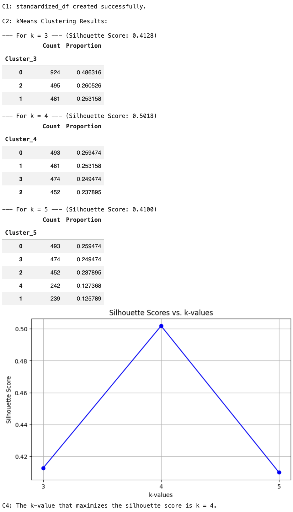

# Customer Churn Prediction & Profit Optimization

## 📌 Project Overview
The goal of this project was to analyze historical transaction data to predict customer churn and simulate profit-optimizing discount strategies. By identifying which customer segments were at the highest risk of leaving, this model allows customer success and sales teams to proactively deploy retention strategies without sacrificing unnecessary revenue.

## 🛠️ Tech Stack & Tools
* **Language:** Python 
* **Libraries:** Pandas, NumPy, Scikit-Learn, Seaborn, Matplotlib
* **Modeling:** K-Means Clustering, Decision Trees, Neural Networks
* **Visualization:** Tableau
* **Environment:** VS Code / Jupyter

## 📊 Exploratory Data Analysis (EDA)
Before modeling, the dataset of over 10,000 retail transactions underwent extensive exploratory analysis to identify non-linear relationships and behavioral patterns between variables like Monthly Active Days and Average Session Duration.

## ⚙️ Methodology & Architecture
1. **Data Preprocessing:** Cleaned the raw transaction data and engineered relevant features using Pandas. Applied one-hot encoding for categorical variables and z-score scaling for numeric features.
2. **Customer Segmentation (K-Means):** Conducted unsupervised clustering to segment the user base. Rigorously tested k-values (k=3, 4, 5) and identified k=4 as the optimal cluster count by maximizing the Silhouette Score.
   

3. **Predictive Model Training:** Built and trained multiple predictive models, comparing a Full Decision Tree against a Reduced Neural Network. 
4. **Rigorous Evaluation:** Evaluated model reliability using strict, business-relevant metrics including Area Under the Curve (AUC), Recall, Precision, and F1-scores to ensure the model avoided overfitting.

## 📈 Key Findings & Business Impact
* The **Reduced Neural Network** emerged as the winning model, achieving a highly balanced **F1-Score of 0.8253** and an impressive **Recall of 90.92%**. 
* High recall was specifically prioritized for this business case, as minimizing false negatives is paramount for capturing actual churners and allowing for proactive intervention.
* Translated the model outputs into an interactive Tableau dashboard, demonstrating how targeted discounting strategies could theoretically optimize retained revenue.

## 🧠 What I Learned
Technically, this project reinforced the importance of using rigorous evaluation metrics beyond surface-level accuracy when dealing with imbalanced churn data. Operationally, bringing my background in heavy manufacturing process optimization into data science, it reinforced my belief that a highly accurate machine learning model only provides value when its outputs are translated into actionable business strategies for frontline teams.
